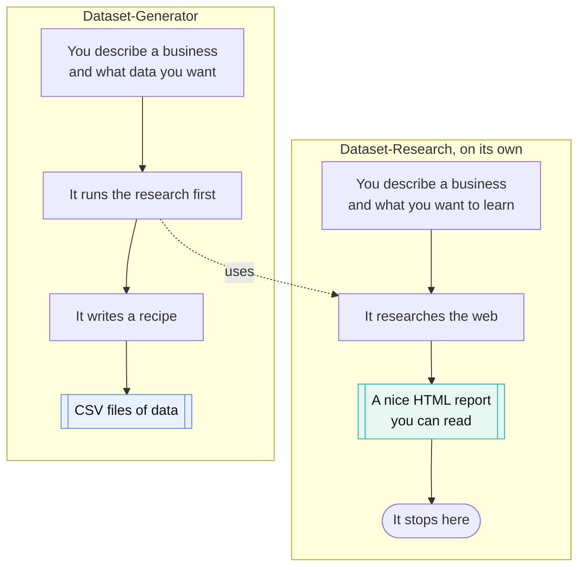
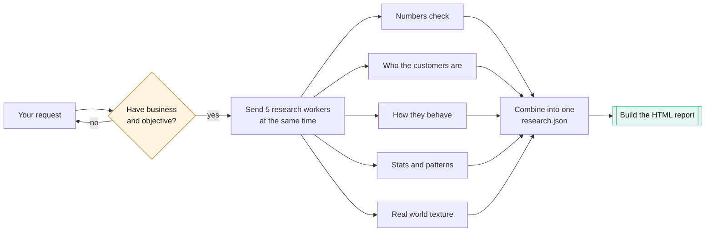
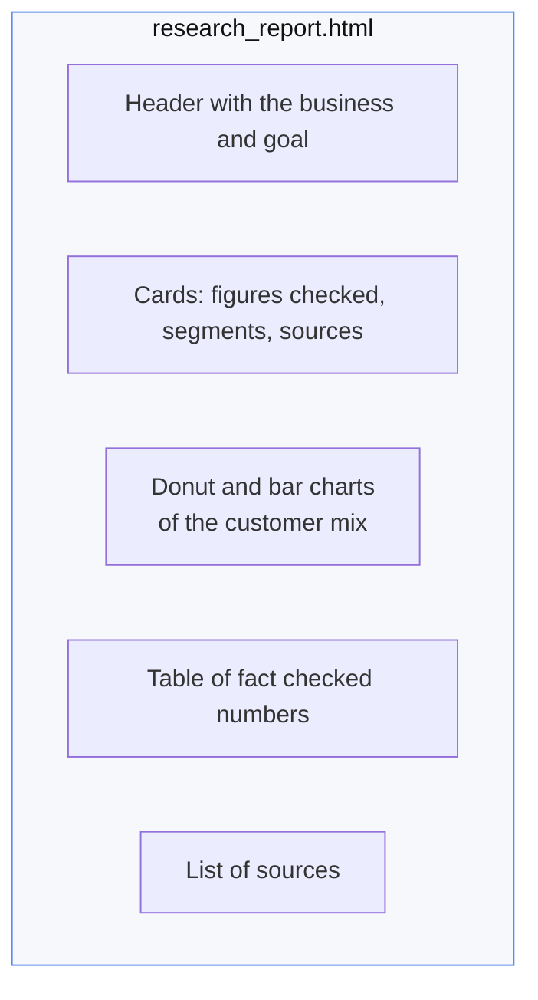
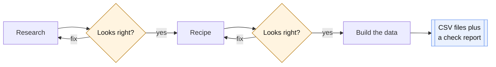
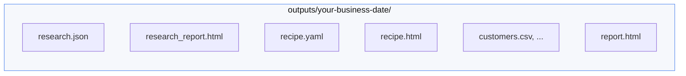

# DataGen

DataGen is a [Claude Code](https://claude.com/claude-code) plugin. You tell it
about a business in plain English. It researches that kind of business on the
web, shows you a good looking report, and then, if you want, builds a fake but
realistic dataset for it.

It does not just spit out random numbers. It looks up real companies first, so
the numbers it uses are grounded in reality. You get to check its work before
anything is generated.

## What is in the box

There are two skills. They do different jobs.



**Dataset-Research** is for when you only want to understand a business. It does
the research and hands you a report. Then it stops. It never builds a dataset.

**Dataset-Generator** is for when you want the actual data. It runs the research
for you, turns it into a recipe, and builds the files.

| Skill | What it gives you | Builds data? |
|---|---|---|
| Dataset-Research | A visual report about the business, backed by a `research.json` file | No |
| Dataset-Generator | The research plus the actual CSV files | Yes |

## What you have to give it

Both skills need two things before they do anything. If you leave one out, they
ask you for it and wait.

| You give it | Example |
|---|---|
| The business | "A mid size grocery chain in tier 2 Indian cities" |
| The objective | "Understand the customers well enough to split them into 4 to 6 groups" |
| Comments (optional) | "Focus on spend and app usage" |

For Dataset-Generator, the comments also say which tables you want and how big.

## How Dataset-Research works

The interesting part is that it does not research everything in one go. It sends
out five small workers at the same time, each looking at one thing. That is
faster and keeps the cost down.



The five workers each have one job:

| Worker | Looks at |
|---|---|
| Numbers check | Is the revenue, store count, growth, and ROI realistic? |
| Who the customers are | Age, gender, income, location |
| How they behave | How often they buy, basket size, channel, loyalty, segments |
| Stats and patterns | The shape of the numbers and how they relate |
| Real world texture | Forums, reviews, and case studies for the human detail |

Everything they find is merged into one small `research.json` file. A Python
script then turns that file into the report. The model does not hand write the
HTML, which is what keeps it cheap and consistent.

## What the report looks like

The report is a single HTML file with no external files, so it opens anywhere.
It has a header, summary cards, colored donut and bar charts for the customer
mix, little shape pictures for each metric, and a list of sources.



## How Dataset-Generator works

It runs the research first, lets you check it, then writes a recipe and builds
the data. You get to say yes or fix things at two points.



The recipe is a plain YAML file. It is the contract for the data: which tables,
which columns, what shape each number has, how the tables link, and the rules
they must follow. Because it is just a file, you can read it and change it before
any data is built.

## Install

```
/plugin marketplace add harishmathh/datagen-plugin
/plugin install datagen
```

Then ask for it in plain words, or use a command.

For research only:

```
/datagen:research A mid size grocery chain in tier 2 Indian cities.
objective: understand the customers well enough to split them into 4 to 6 groups.
comments: focus on spend and app usage.
```

For the full dataset:

```
/datagen:generate A mid size grocery chain in tier 2 Indian cities.
objective: a sample dataset for testing a segmentation model.
comments: customers, spending, and engagement tables, about 10k customers.
```

## What the engine can do

The engine reads a recipe and writes one CSV per table. Everything is seeded, so
the same recipe gives the same data every time.

- **Shapes:** normal, lognormal, uniform, exponential, poisson, beta, gamma,
  pareto, zipf, bernoulli, weighted categories, constant, and dates with monthly
  and weekday seasonality.
- **Links between numbers:** real correlation between columns, different
  distributions based on another column, computed columns, and pulling a column
  from a sibling table.
- **Tables that join:** shared id pools so every table lines up with no orphans.
- **Rules:** boolean rules enforced per row, fixed by resample, clip, drop, or
  error.
- **Outliers and gaps:** realistic long tails and missing values.
- **Text:** Faker for names, cities, and emails, and real LLM written text for
  free form fields. It batches and caches the LLM calls to keep cost down, and
  falls back to clear placeholders when offline.
- **Check report:** per column stats, how close the data is to the recipe, and a
  foreign key check, all in one HTML file.

## What you end up with

Everything for one run lands in `outputs/<business-name>-<date>/`.



Run Dataset-Research on its own and you get the first two. Run Dataset-Generator
and you get all of them.

## Requirements

- Python 3.10 or newer with `numpy`, `pandas`, and `PyYAML`. `jsonschema`,
  `Faker`, and `anthropic` are optional and the engine works without them.
- `ANTHROPIC_API_KEY` is only needed if you want real LLM written text columns.

```
pip install -r plugins/datagen/requirements.txt
```

## Using the engine by hand

```bash
# build the research report from a research.json
python plugins/datagen/engine/render.py research research.json research_report.html

# check a recipe
python plugins/datagen/engine/validate_recipe.py recipe.yaml

# build data, 10 percent preview, no LLM
python plugins/datagen/engine/generate.py --recipe recipe.yaml --out outputs/run \
       --rows-scale 0.1 --offline

# build the check report
python plugins/datagen/engine/render.py report outputs/run/generation_report.json report.html
```

See
[`recipe_template.yaml`](plugins/datagen/skills/dataset-generator/recipe_template.yaml)
for every recipe feature with comments, and
[`recipe.schema.json`](plugins/datagen/engine/recipe.schema.json) for the full
schema.

## How the plugin is laid out

```
.claude-plugin/marketplace.json        the marketplace entry
plugins/datagen/
  .claude-plugin/plugin.json           the plugin entry
  agents/                              the 5 research workers
  commands/                           /datagen:research and /datagen:generate
  hooks/                              a safe reminder hook for the required inputs
  skills/dataset-research/           research only, ends with the HTML report
  skills/dataset-generator/          the full pipeline, calls research first
  engine/                            the Python engine, schema, and renderers
  requirements.txt
```

## License

MIT. See [LICENSE](LICENSE).
