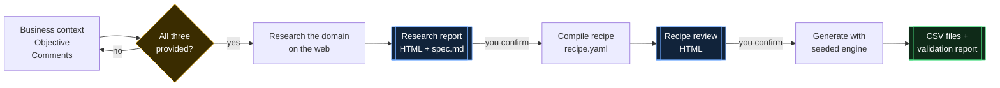
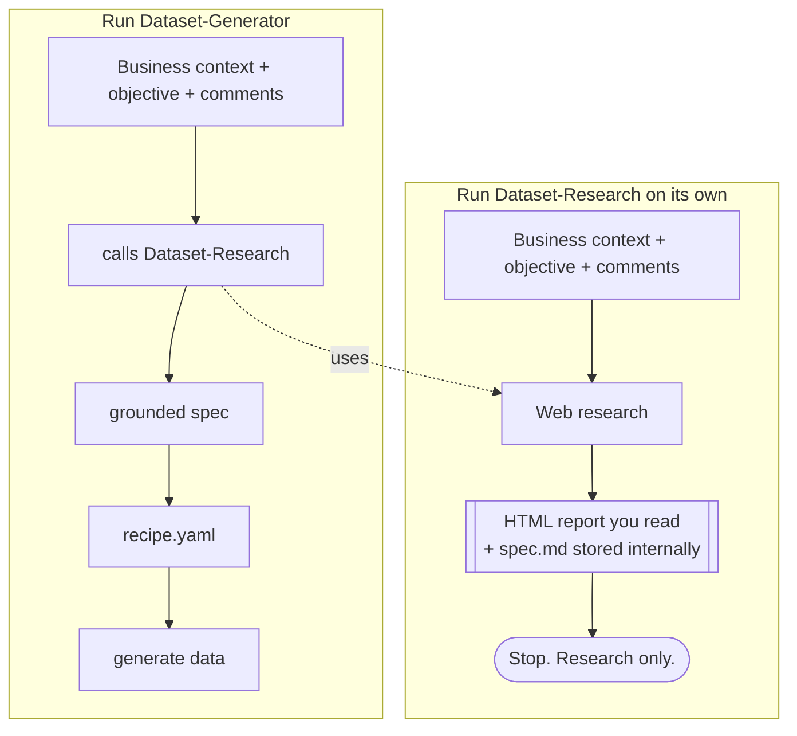
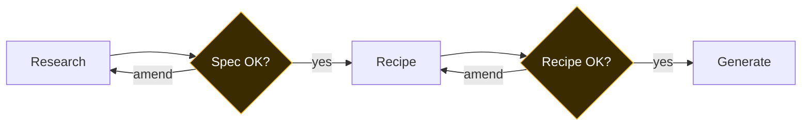
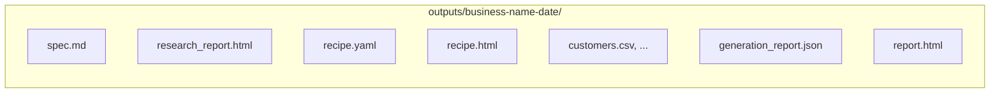

# DataGen, a research-grounded synthetic dataset generator

A [Claude Code](https://claude.com/claude-code) plugin that turns a plain-English
**business context plus an objective** into **synthetic but realistic datasets**.

It does not just spit out random numbers. It first researches the real-world
domain on the web so every figure is grounded, gets you to sign off on what it
found, compiles a readable YAML "recipe," lets you review that too, and only
then builds the data with a deterministic Python engine: distributions,
correlations, conditional logic, hard constraints, multi-table referential
integrity, and LLM-authored text.



## The two skills, and how they relate

There are two skills, and the distinction matters.



| Skill | Invoked on its own it... | Used by the other? |
|---|---|---|
| **Dataset-Research** | Researches the domain and hands you a visual HTML report (backed by an internal `spec.md`). Then it **stops**. It never writes a recipe or generates data. | No. It is fully standalone. |
| **Dataset-Generator** | Runs the whole pipeline: research, recipe, generate. | Yes. It **calls Dataset-Research** to get its grounded inputs, then takes over. |

So: invoke **Dataset-Research** when you only want the research. Invoke
**Dataset-Generator** when you want the actual dataset, and it will pull in the
research for you.

## Both skills require three inputs

Neither skill does anything until it has all three of these. If one is missing,
it asks you and waits.

| Input | What it is |
|---|---|
| **Business context** | The company and what it does. |
| **Objective** | What the research or dataset is for. |
| **Additional comments** | Geography, which datasets, sizes, special needs. |

## Two review gates



You confirm after the **spec** (is the research right?) and after the **recipe**
(is the generation contract right?). Generation only runs once you pass the
second gate.

## Install

```
/plugin marketplace add harishmathh/datagen-plugin
/plugin install datagen
```

Then just say what you want. For research only:

> Research the customer base for BrightBasket Retail, a mid-size grocery chain
> in tier-2 Indian cities. Objective: understand it well enough to segment into
> 4 to 6 groups. Comments: focus on spend and digital engagement.

For the full dataset, ask Dataset-Generator the same way and it handles the
research itself.

## What the engine can do

The generation engine (`plugins/datagen/engine/`) reads a recipe and emits one
CSV per dataset, fully seeded and reproducible:

- **Distributions:** normal, lognormal, uniform, exponential, poisson, beta,
  gamma, pareto, zipf, bernoulli, weighted categorical, constant, and datetime
  (uniform or with monthly and weekday **seasonality**).
- **Relationships:** induced numeric **correlation** (Gaussian-copula,
  marginal-preserving), **conditional** distributions keyed on another column,
  **derived** columns via a sandboxed expression evaluator, and cross-table
  column **inheritance**.
- **Multi-table referential integrity:** shared **entity** id pools with 1:1
  primary keys and many:1 **foreign keys**, so all tables join cleanly.
- **Constraints:** boolean expressions enforced per row with `resample`, `clip`,
  `drop`, or `error` repair.
- **Outliers and missingness:** realistic tails and nullable fractions.
- **Text columns:** `faker` for structured text (names, cities, emails) and
  `type: text` for LLM-authored free text via the Anthropic API, batched,
  concurrent, cached on disk, with `cardinality` cost control. Falls back to
  clearly-marked placeholders when offline.
- **Validation report:** per-column stats, distribution-fidelity against the
  recipe, categorical drift, and FK-integrity checks, rendered as an HTML
  artifact.

## What you get out



Everything for one run lands in `outputs/<business-name>-<date>/`. Run
Dataset-Research on its own and you get the first two. Run Dataset-Generator and
you get all of them.

## Requirements

- Python 3.10+ with `numpy`, `pandas`, and `PyYAML` (required). `jsonschema`,
  `Faker`, and `anthropic` are optional; the engine degrades gracefully.
- `ANTHROPIC_API_KEY` is only needed for `type: text` columns.

```
pip install -r plugins/datagen/requirements.txt
```

## Using the engine directly

```bash
# validate a recipe
python plugins/datagen/engine/validate_recipe.py recipe.yaml

# generate (10% preview, offline)
python plugins/datagen/engine/generate.py --recipe recipe.yaml --out outputs/run \
       --rows-scale 0.1 --offline

# render review artifacts
python plugins/datagen/engine/render.py recipe recipe.yaml recipe.html
python plugins/datagen/engine/render.py report outputs/run/generation_report.json report.html
```

See [`recipe_template.yaml`](plugins/datagen/skills/dataset-generator/recipe_template.yaml)
for an annotated reference of every recipe feature, and
[`recipe.schema.json`](plugins/datagen/engine/recipe.schema.json) for the
authoritative schema.

## Repository layout

```
.claude-plugin/marketplace.json      marketplace manifest
plugins/datagen/
  .claude-plugin/plugin.json         plugin manifest
  skills/dataset-research/           SKILL.md, spec_template.md   (standalone)
  skills/dataset-generator/          SKILL.md, recipe_template.yaml (calls research)
  engine/                            generate.py, distributions, constraints,
                                     relations, tables, llm_text, faker_cols,
                                     safe_eval, validate, render, schema, tests
  requirements.txt
```

## License

MIT, see [LICENSE](LICENSE).
